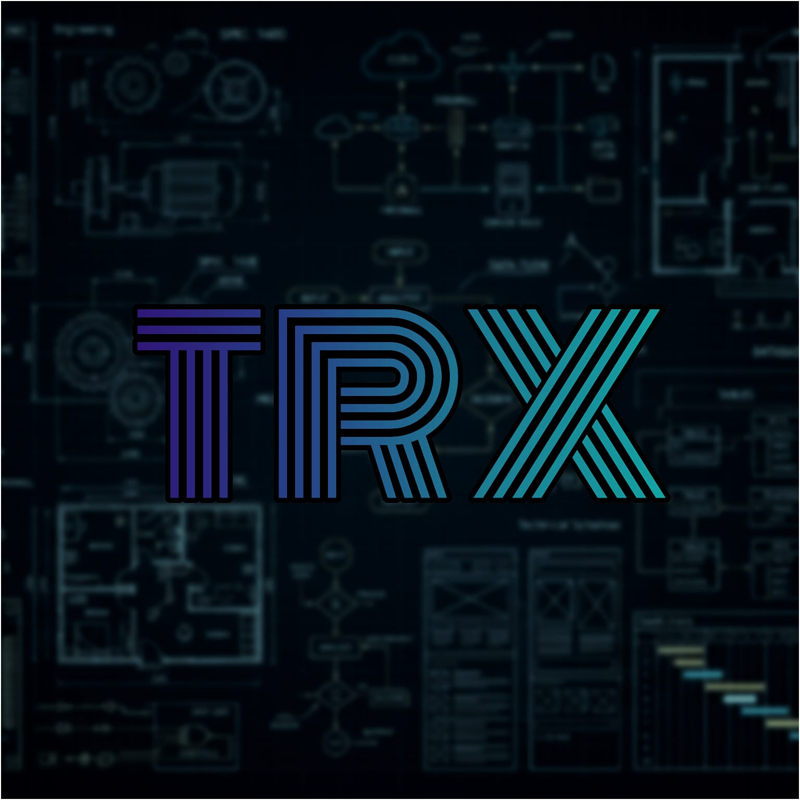

# TRX Language Core Engine

## About The Project

TRX is a proprietary, dynamic programming language designed specifically to power a complex reactive spatial-mapping engine. This language offers a stable and expandable environment designed for complex diagram calculation and the development of dynamic layouts.

Built from the ground up, the TRX is a highly specialized language for handling everything from tokenization and parsing to Abstract Syntax Tree (AST) evaluation.

## Next-Gen Wasm Diagramming Architecture

TRX 2.0 features a completely new **Zero-Copy WebAssembly Diagramming Engine**, prioritizing mechanical sympathy, data-oriented design, and browser sandboxing.

### Key Features Implemented:
* **Zero-Copy Parser Bridge:** Wasm linear memory pointer exchange for instant DSL string parsing.
* **Dual-Engine Layout:** Physics-based (Force-directed) and Layered (Sugiyama-style) topological band routing.
* **Geometric Primitives & Styling:** Native SVG implementations for `hexagon`, `cloud`, `cylinder`, and `parallelogram`. Attributes route through a zero-copy `StyleBuffer` to 4-byte RGBA arrays.
* **Schema Visualization:** Bit-accurate `packet` headers and `sqltable` data definitions with PK/FK indicators.
* **Interactive DOM Proxy:** Emits ARIA standard tags (`<title>`) and interactive URL anchors natively into SVG outputs.
* **Spatial Partitioning:** O(n log n) quadtree for collision detection and edge routing.
* **Static Text Metrics:** Embedded monospace character-width tables inside Wasm for DOM-free bounding box calculations.
* **Scenario State Management:** Filter monolithic ASTs down to specific diagram scenarios using `[scenario: "name"]`.

## Usage

```bash
# Compile TRX files to either JSON or SVG rendering
trx compile <input.trx> <output.svg>
trx compile <input.trx> <output.json>
```

